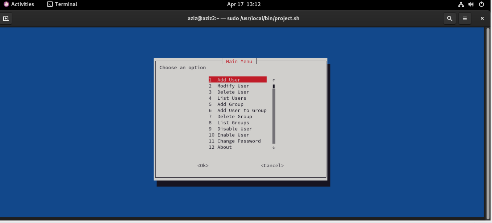

# Linux User Management CLI Tool

A menu-driven CLI tool built with Bash and Whiptail for automating Linux user and group management tasks with validation and error handling.
---
## 📌 Overview
User management is a fundamental task in Linux system administration. This tool simplifies repetitive administrative tasks by providing an interactive CLI interface built with Bash and Whiptail.
---
## 🎯 Use Cases
- System administrators managing multiple users
- DevOps engineers automating server tasks
- Students practicing Linux administration
---
## 🚀 Features
- Add / Delete / Modify Users
- Lock / Unlock Accounts
- Change Passwords
- Manage Groups
- Input validation & error handling
- Root privilege enforcement

---

## 🛠️ Technologies
- Bash Scripting
- Whiptail (TUI)
- Linux System Administration

---

## 📸 Screenshots


---

## ⚙️ Usage
```bash
git clone https://github.com/abdelazizhedeia/linux-user-management-cli.git
cd linux-user-management-cli
chmod +x script.sh
sudo ./script.sh
